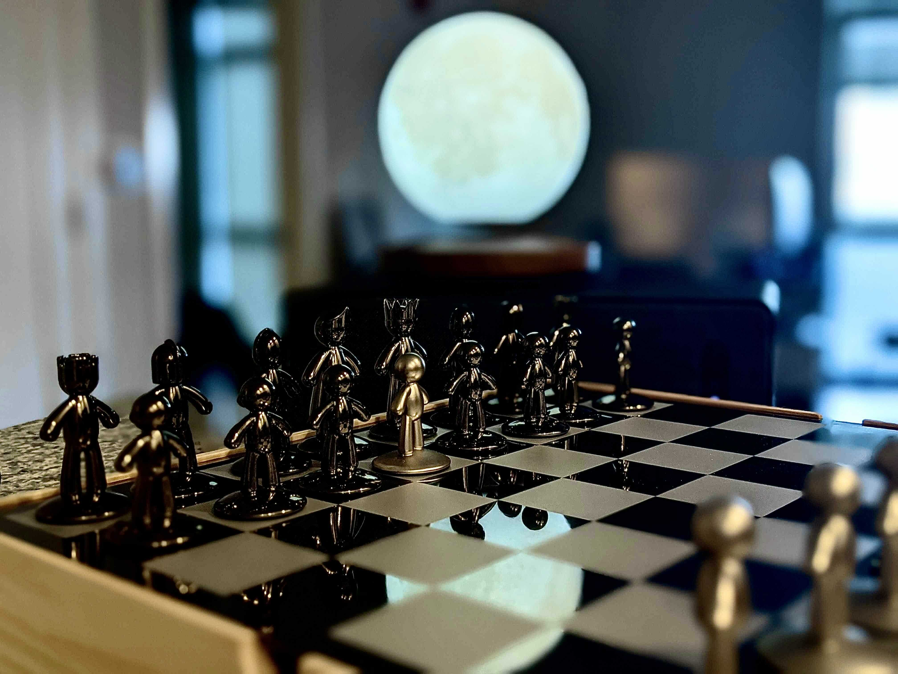

Backstory: I’ve only been studying and practicing meditation for the last year and half (thanks, Covid). I am certainly no expert, and what works for me is very specific to my needs. I attribute most of my theories to a combination of therapy, Headspace, and reading Breaking the Habit of Being Yourself. And through those resources combined with observing how I feel before and after playing a competitive game of chess, I present my thoughts on the game of chess applied to meditation. 

I started playing chess competitively about 2 years ago. At first, I knew nothing about the game. I knew how to set up the board and the way that pieces were allowed to move, but that’s it. And after 6 months of playing (being beaten, brutally by) two brilliant people from my circle, I finally started to understand the strategy behind the game. 

Now that I’ve become a very average chess player (I play 5-6 times per week, probably around 1500 elo), I have found that when I’m mindful, I can reach a point where for the full-hour, I am only thinking about what's happening on the board. And as someone that pretends she can think about 25 things at once, I have found that level of focus to be an incredibly relaxing, meditative experience. It doesn’t always happen, but when it does, the connection that I feel to the strategy happening on the board resonates similarly to the connection I feel to my breath when I am practicing traditional meditation. After the game, I feel calm, focused, and back to a place where I can think clearly. 

So if you’re a fellow human that enjoys problem-solving and puzzles, and has access to a chess board (lichess.org is free - but requires a device with an internet connection) and you’re looking for a way to zone out and relax for an hour or so, consider giving chess a try. 

Bonus points if you challenge me to a game on lichess.org (knightmare_23) :) 
